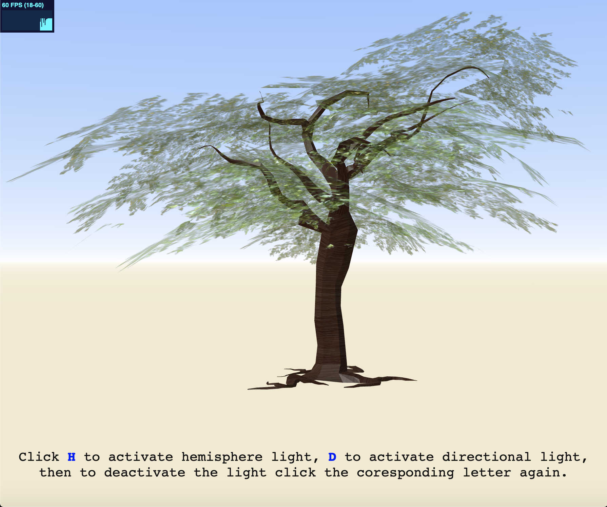
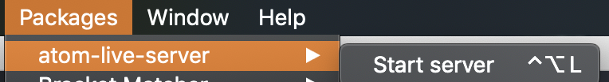

## DAT505

# Tree of Life

## What's in the doc

This is a three.js project, in this project I have spent time developing a calming tree using MAYA, I also added a horizon background with the option to change the lighting to do this you need to use H and D on your keyboard, this allows you to add whatever tone you want to the tree, you can also move all around the scene to explore the tree or if you just want to look at the background you also have that option and freedom, there is also a calming wind sound in the background.

what to expect:

## How to Load

To load simply clone this repository or save it to your desktop, Open the code and documents in ATOM or what your preferred code reader is. Start a live server, with atom you can access one through packages, and that is all, everything will load up and enjoy the calming effects the whole scene has to offer.

How to find ATOM live server:

